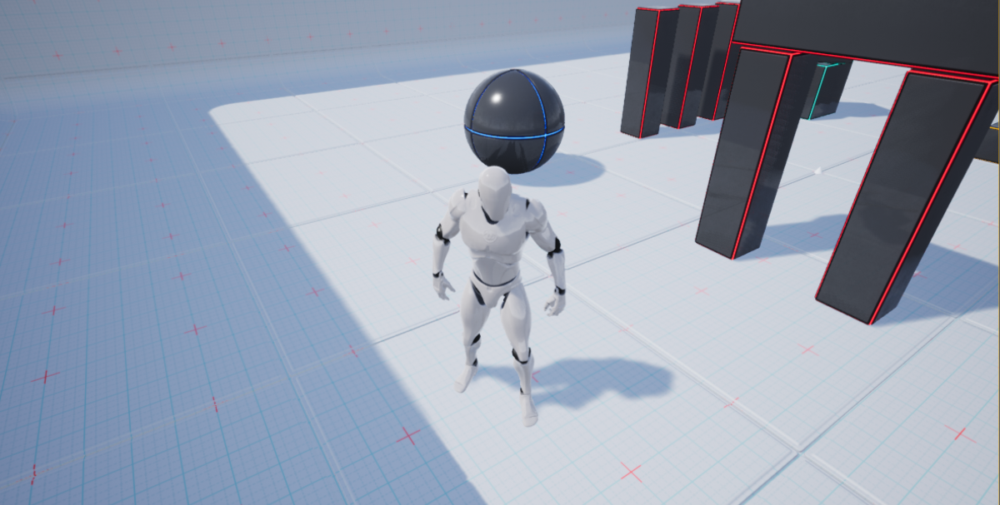

# UE4 World Grid Material

# Introduction
On starting development, we sometimes need to prepare a grid floor of a specific color.
In this repository, a material with following features is managed.

- Project multiple grid textures from the x-y-z axis which closest to the fragment normal.
- Grid texture is repeated every 100 units (1m) in world coordinates.
- You can specify both grid texture and background color.

All of grid textures are generated using [this repository](https://github.com/jnphgs/GridUnitsSVG) as SVG files.
And SVG files are converted to PNG images using [this repository](https://github.com/jnphgs/BatchSVGtoPNG).

# Environment
- Unreal Engine 4.22.1